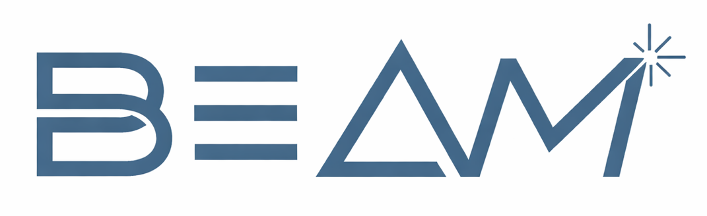

<p align="center">
  
</p>

# BEAM-ML

**B**uild **E**valuation for **A**dditive **M**anufacturing

Machine learning system for predicting relative density in Laser Powder Bed Fusion (L-PBF) additive manufacturing. Combines process parameters with material thermophysical properties to improve density prediction accuracy.

## Live API

**Production endpoint**: https://lpbf-api-634665180236.europe-west2.run.app/docs

Interactive API documentation with example requests and responses.

**Quick links:**
- [Health Check](https://lpbf-api-634665180236.europe-west2.run.app/api/v1/health) - API status
- [Model Info](https://lpbf-api-634665180236.europe-west2.run.app/api/v1/model-info) - Deployed model details

## Quick Start

### Docker Deployment

Run the API locally using Docker:

```bash
# Build (exports model + builds image)
scripts\build_docker.bat    # Windows
# bash scripts/build_docker.sh  # Linux/Mac

# Run the container
docker run -p 8080:8080 lpbf-api

# Access at http://localhost:8080/docs
```

Or use docker-compose:

```bash
docker-compose up
```

### Manual Install
```bash
# 1. Create virtual environment
python -m venv .venv

# 2. Activate virtual environment
.venv\Scripts\Activate.ps1        # Windows PowerShell
# source .venv/bin/activate        # Linux/Mac

# 3. Install project
pip install -e .

# 4. Train models
python scripts/train_model.py

# 5. View results in MLflow UI
mlflow ui
# Then open http://localhost:5000
```

## UV
```bash
uv venv && .venv\Scripts\Activate.ps1 && uv pip install -e .
```

## Limitations

### Model Scope
- **Training data coverage**: The model is trained on certain metallic alloys (316L, AlSi10Mg, Ti6Al4V, IN625, IN718, CuCrZr). Predictions for other materials or alloy compositions may be unreliable.
- **Parameter ranges**: Best performance within the training data range. Extrapolation beyond observed parameter combinations (extreme laser powers, scan speeds, etc.) is not validated.
- **Process assumptions**: Model assumes standard L-PBF processes.

### Measurement Variability
- **Density methods differ**: Archimedes, image analysis, and computed tomography methods can yield different density values for the same part. The model learns from mixed measurement methods but cannot compensate for systematic differences.
- **Local vs bulk density**: Predictions represent bulk relative density. Local porosity variations, surface roughness effects, and microstructural defects are not captured.

### Real-World Factors Not Modeled
- **Powder characteristics**: Beyond D50 particle size, powder morphology, flowability, and contamination are not considered.
- **Environmental conditions**: Oxygen levels, chamber humidity, and thermal history effects are not included.
- **Machine calibration**: Assumes properly calibrated equipment. Laser degradation, focusing errors, and recoater blade wear are not factored.

### Known Model Behaviors
- **Material property dependencies**: Predictions rely on accurate thermophysical properties. Proprietary alloy variations with unlisted compositions may reduce accuracy.
- **Inter machine variation**: Predictions depend heavily on which machine is selected.

### Recommended Use
This model is best suited for:
- Initial parameter screening and design of experiments
- Comparative analysis of parameter sets
- Educational demonstrations of ML in additive manufacturing

## Data Provenance

This project builds upon the L-PBF dataset published by Barrionuevo et al.:

**Base Dataset:**
- Barrionuevo, G.O., La Fé-Perdomo, I. & Ramos-Grez, J.A. (2025)
- *Laser powder bed fusion dataset for relative density prediction of commercial metallic alloys*
- Scientific Data 12, 375
- DOI: [10.1038/s41597-025-04576-x](https://doi.org/10.1038/s41597-025-04576-x)
- Dataset: [Harvard Dataverse](https://doi.org/10.7910/DVN/VPBQK8)
- License: CC0 1.0 (Public Domain)

**Our Contribution:**
We extend this dataset by enriching it with thermophysical properties (melting point, thermal conductivity, density, specific heat capacity) for each material from NIST, ASM Handbook, and manufacturer datasheets.


- https://asm.matweb.com/search/specificmaterial.asp?bassnum=ninc34
- https://www.renishaw.com/resourcecentre/download/data-sheet-renam-500-series-aluminium-alsi10mg-material-data-sheet--138868?userLanguage=en&&srsltid=AfmBOorf51bVWj96eGtwhx7_hEHThwE6vD8TriwUm3IzQQOD-tN2TpAi
- https://xometry.pro/wp-content/uploads/2023/08/Aluminium-1706-1.pdf
- https://www.matweb.com/search/datasheet_print.aspx?matguid=1336be6d0c594b55afb5ca8bf1f3e042
- https://www.aurubis.com/dam/jcr:d6d50d64-69d6-4742-821d-8fb8b48c9044/cucrzr-c18160-pna-372_en.pdf

