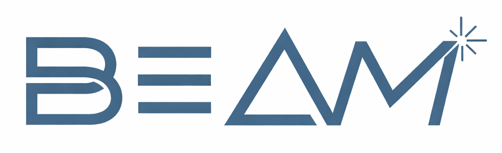
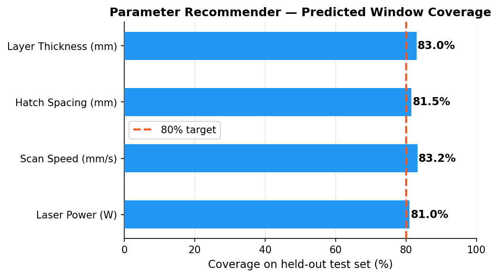
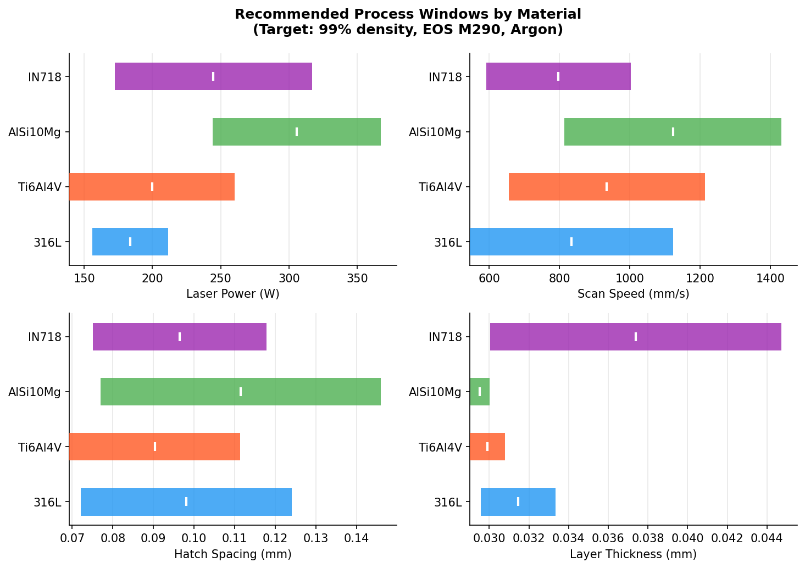

<p align="center">
  
</p>

# BEAM-ML

**B**uild **E**valuation for **A**dditive **M**anufacturing

Machine learning system for Laser Powder Bed Fusion (L-PBF) additive manufacturing.

[](https://beam-ml.machinor.systems/)

Two tools in one API:

- **Parameter recommender** - give it a target density, material, and printer model and it returns a calibrated 80% process window to start your experiments from. This is the primary use case.
- **Density sanity check** - give it a parameter set and it tells you whether those parameters are in a viable density regime. Useful for screening out obviously bad combinations, not for precise density prediction.

## Live API

**Production endpoint**: https://beam-ml.machinor.systems/docs

Interactive API documentation with example requests and responses.

**Quick links:**
- [Health Check](https://beam-ml.machinor.systems/api/v1/health) - API status
- [Model Info](https://beam-ml.machinor.systems/api/v1/model-info) - Deployed model details
- [Printer Models](https://beam-ml.machinor.systems/api/v1/printer-models) - Supported machines

## API Endpoints

| Method | Endpoint | Description |
|--------|----------|-------------|
| `POST` | `/api/v1/recommend-parameters` | Given a target density, material, and printer returns a calibrated 80% process window |
| `POST` | `/api/v1/predict` | Given a parameter set returns a density estimate with confidence interval as a sanity check |
| `GET` | `/api/v1/printer-models` | List all supported printer models |
| `GET` | `/api/v1/model-info` | Loaded model details |
| `GET` | `/api/v1/feature-ranges` | Valid input ranges from training data |
| `GET` | `/api/v1/health` | Service health check |

## Quick Start

### Docker Deployment

Run the API locally using Docker:

```bash
# Build (exports model + builds image)
scripts\build_docker.bat    # Windows
# bash scripts/build_docker.sh  # Linux/Mac

# Run the container
docker run -p 8080:8080 lpbf-api

# Access at http://localhost:8080/docs
```

Or use docker-compose:

```bash
docker-compose up
```

### Manual Install
```bash
# 1. Create virtual environment
python -m venv .venv

# 2. Activate virtual environment
.venv\Scripts\Activate.ps1        # Windows PowerShell
# source .venv/bin/activate        # Linux/Mac

# 3. Install project
pip install -e .

# 4. Train models
python scripts/train_model.py

# 5. View results in MLflow UI
mlflow ui
# Then open http://localhost:5000
```

## UV
```bash
uv venv && .venv\Scripts\Activate.ps1 && uv pip install -e .
```

## Model Performance

### Parameter Recommender

Evaluated on a held-out test set (20%, split by study DOI to prevent data leakage). Coverage is how often the actual parameter used in a successful build falls within the predicted window, the target is 80%.

The recommender is well-calibrated: targeting 80% coverage and achieving 81–83% across all four parameters on a held-out test set.



The recommended windows are material-specific, the model accounts for why different alloys need different parameters, not just that they do.



### Density Predictor

The density predictor functions as a sanity check, useful for identifying obviously bad parameter combinations but should not be treated as a precise point estimate. The wide confidence interval reflects genuine uncertainty in process-density relationships across the dataset.

## Limitations

### Model Scope
- **Training data coverage**: The model is trained on certain metallic alloys (316L, AlSi10Mg, Ti6Al4V, IN625, IN718, CuCrZr). Predictions for other materials or alloy compositions may be unreliable.
- **Parameter ranges**: Best performance within the training data range. Extrapolation beyond observed parameter combinations (extreme laser powers, scan speeds, etc.) is not validated.
- **Process assumptions**: Model assumes standard L-PBF processes.

### Measurement Variability
- **Density methods differ**: Archimedes, image analysis, and computed tomography methods can yield different density values for the same part. The model learns from mixed measurement methods but cannot compensate for systematic differences.
- **Local vs bulk density**: Predictions represent bulk relative density. Local porosity variations, surface roughness effects, and microstructural defects are not captured.

### Real-World Factors Not Modeled
- **Powder characteristics**: Beyond D50 particle size, powder morphology, flowability, and contamination are not considered.
- **Environmental conditions**: Oxygen levels, chamber humidity, and thermal history effects are not included.
- **Machine calibration**: Assumes properly calibrated equipment. Laser degradation, focusing errors, and recoater blade wear are not factored.

### Known Model Behaviors
- **Material property dependencies**: Predictions rely on accurate thermophysical properties. Proprietary alloy variations with unlisted compositions may reduce accuracy.
- **Density predictor precision**: The density predictor is not reliable for discriminating between parameter sets that both produce high-density parts. Use it to screen out bad combinations, not to rank good ones.

### Recommended Use
- **Starting a parameter study**: Use the recommender to get a process window, then refine experimentally.
- **Screening parameter sets**: Use the density predictor to check whether a combination is in a viable regime before committing to a build.
- Not a substitute for experimental validation.

## Data Provenance

This project builds upon the L-PBF dataset published by Barrionuevo et al.:

**Base Dataset:**
- Barrionuevo, G.O., La Fé-Perdomo, I. & Ramos-Grez, J.A. (2025)
- *Laser powder bed fusion dataset for relative density prediction of commercial metallic alloys*
- Scientific Data 12, 375
- DOI: [10.1038/s41597-025-04576-x](https://doi.org/10.1038/s41597-025-04576-x)
- Dataset: [Harvard Dataverse](https://doi.org/10.7910/DVN/VPBQK8)
- License: CC0 1.0 (Public Domain)

**Our Contribution:**
We extend this dataset by enriching it with thermophysical properties (melting point, thermal conductivity, density, specific heat capacity) for each material from NIST, ASM Handbook, and manufacturer datasheets.


- https://asm.matweb.com/search/specificmaterial.asp?bassnum=ninc34
- https://www.renishaw.com/resourcecentre/download/data-sheet-renam-500-series-aluminium-alsi10mg-material-data-sheet--138868?userLanguage=en&&srsltid=AfmBOorf51bVWj96eGtwhx7_hEHThwE6vD8TriwUm3IzQQOD-tN2TpAi
- https://xometry.pro/wp-content/uploads/2023/08/Aluminium-1706-1.pdf
- https://www.matweb.com/search/datasheet_print.aspx?matguid=1336be6d0c594b55afb5ca8bf1f3e042
- https://www.aurubis.com/dam/jcr:d6d50d64-69d6-4742-821d-8fb8b48c9044/cucrzr-c18160-pna-372_en.pdf

